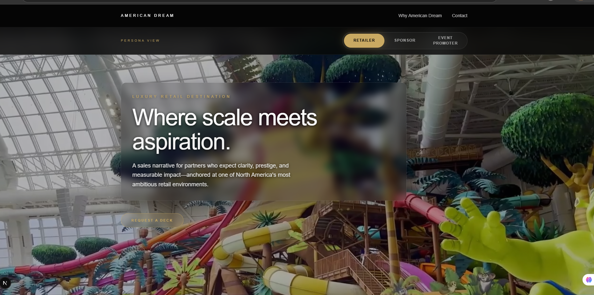
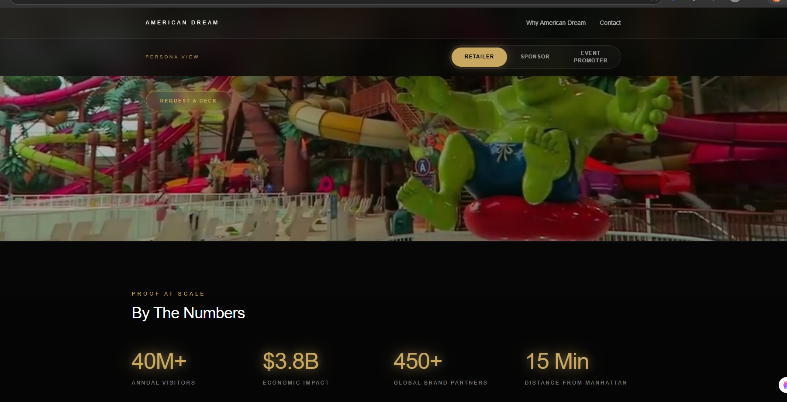

# American Dream: Interactive Sales Experience

## 📸 Project Showcases

---
*Note: Make sure your file names in the /public/screenshots folder match these exactly (e.g., image1.png, image2.png, image3.png).*

A cinematic, non-linear sales tool built with Next.js and AI to replace static PDFs. This platform features a persona-driven UI that instantly adapts data for retailers, sponsors, and event promoters to drive high-stakes conversions.

## 🚀 Live Demo
**[View Live Project](https://mall-pitch-deck.vercel.app)**

## ✨ Key Features
- **Persona-Driven Navigation:** A custom interface that pivots storytelling based on the viewer (Retailer, Sponsor, or Promoter).
- **Luxury UI:** High-fidelity "Glassmorphism" design with liquid-smooth Framer Motion transitions.
- **Optimized for Safari:** Hardened video delivery and layout fixes for mobile and desktop Safari.
- **AI-First Workflow:** Developed using Cursor AI for logic and Generative AI for luxury renders.

## 🛠️ Tech Stack
- **Framework:** Next.js 14 (App Router)
- **Styling:** Tailwind CSS
- **Animations:** Framer Motion
- **Deployment:** Vercel

## 📦 Setup
1. `npm install`
2. `npm run dev`